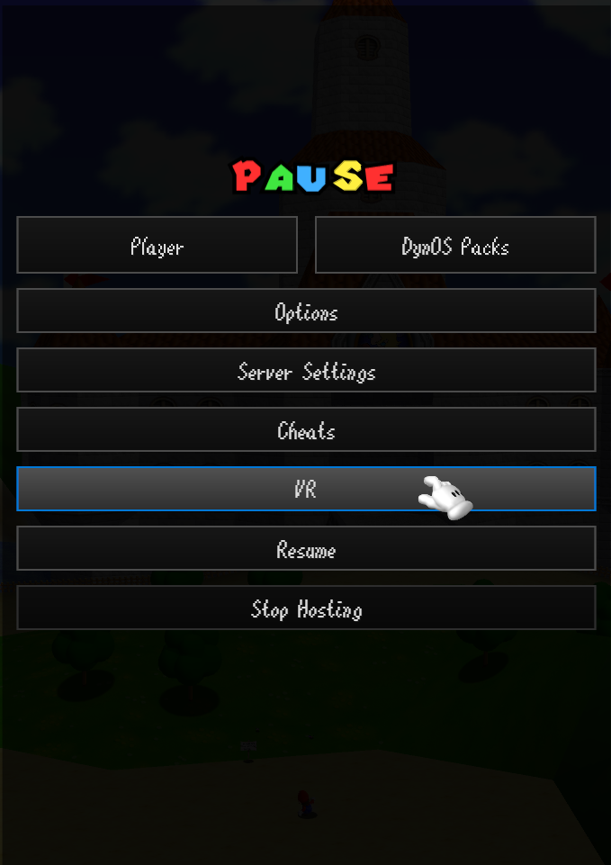
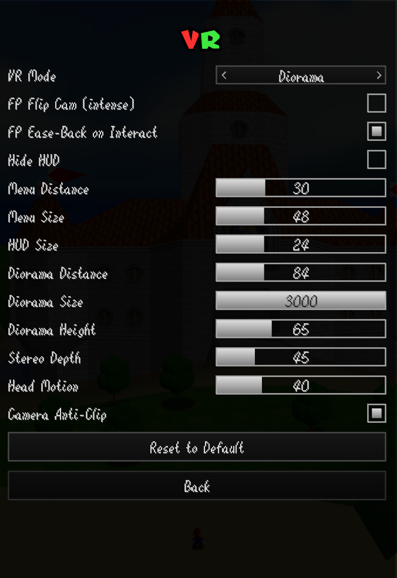

# sm64coopdx VR

Super Mario 64 in VR, built on the sm64coopdx PC port. With a headset on, the game renders in immersive VR. You can lean around and look into the world.
With no headset it just runs as the normal flatscreen game. Same exe, it works out which one you
want on its own.

Tested on Quest 3 and Pimax, but it should run with any PCVR / OpenXR runtime.

You bring your own Super Mario 64 US ROM. There's nothing from Nintendo in this repo, just code.
coopdx reads the rom locally when the game starts, same as normal sm64coopdx, and it never leaves
your machine.

## Download and play

1. Grab sm64coopdx-vr.zip from the Releases page.
2. Unzip it somewhere.
3. Put your Super Mario 64 US ROM in the folder and name it baserom.us.z64. (On first run you can
   also just drag any .z64 onto the window and it sets that up for you.)
4. Run sm64coopdx.exe.

If a headset is connected it boots into VR, otherwise you get the flat game. Start your VR runtime
first (Quest Link, Virtual Desktop, SteamVR) if you want VR. Your mods and saves carry over like
normal.

Already have sm64coopdx installed? You can skip the unzip step and just copy the exe plus all the
DLLs from the release (libopenxr_loader.dll and the libgcc/libstdc++/libwinpthread ones next to it)
into your existing folder.

## Controls

You play with the same input sm64coopdx normally uses:

- Gamepad: DualSense (PS5), DualShock 4 (PS4), Xbox, Switch Pro, or any other SDL-compatible
  controller, wired or over Bluetooth. It uses your existing coopdx control bindings.
- Mouse and keyboard.

In VR your head moves the view on top of that. Real VR motion-controller support isn't done yet, so
for now movement and buttons come from the gamepad or keyboard exactly like the flat game, and the
headset just drives where you look.

### VR menu

All the VR settings are in-game. Pause and open the VR button, right after Mod Menu:

It has view distance, size and height, stereo depth, head motion, first person, and camera anti-clip,
plus a Reset to Default button:

The one keyboard shortcut is F10, which cycles the view (diorama / close-up / first-person).

## Building from source

Skip this if you just grabbed the release. To build it yourself:

1. Set up MSYS2 and the normal sm64coopdx build environment (see the upstream repo at
   https://github.com/coop-deluxe/sm64coopdx).
2. Put your baserom.us.z64 in the project root.
3. Run build_vr.bat. It pulls the one extra dependency (the OpenXR SDK) and compiles. You end up
   with build\us_pc\sm64coopdx.exe.

vr-support.patch is the whole VR change as one diff, if you'd rather apply it to a clean checkout
and build that. The technical writeup is in VR_README.md.

## Credits

sm64coopdx by the Coop Deluxe Team. Super Mario 64 belongs to Nintendo, bring your own rom. VR work
by RaYRoD.
